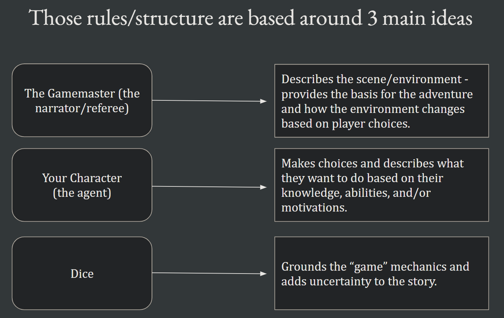

!!! tip "Where to start?" 
      
      Read pages 2-5 of the [Basic Rules PDF](../resources/PlayerDnDBasicRules_v0.2_PrintFriendly.pdf). It will give you a good idea of what D&D is and how it works. You can also watch the videos in the [Resources section](resources.md) for a quick overview.
## What is D&D (Dungeons & Dragons)? 🐉🎲

Imagine a video game where you have the freedom to do anything, unrestricted by technology or developer limitations:

- Perform a backflip off a table and stab Bob, a random NPC at a tavern, who made fun of your wig. 🤸‍♂️🗡️
- Pick up a mug from the table and throw it at Bob. 🍺👉👨
- Convince Bob that your wig is a powerful, sentient creature not happy with what he said. 🤔🧙‍♀️🎩
- Turn Bob into a goat. 🐐🧙‍♂️
- Burn down Bob's house. 🔥🏠
- Simply walk away, deciding that Bob is not worth your time. 🚶‍♀️🤷‍♂️

Now, envision a story shaped entirely by **your choices**, not limited to a few predetermined branches leading to a handful of endings. You can witness the consequences of your actions unfold in the world. 🌍🔍

**This is the essence of Dungeons & Dragons (D&D)**. It is one of many Tabletop RPGs, set in a fantasy world, granting players limitless possibilities in how they play. However, since an entirely boundless sandbox can be overwhelming and less enjoyable, D&D provides rules, advice, and structure to navigate the world and make the experience fun. 🎭📘

## Example Setting: The Forgotten Realms 🏰🌄

In D&D, the world can be anything the Dungeon Master (DM) and players can imagine. It might be a swords-and-sorcery setting with barbarians battling evil sorcerers or a post-apocalyptic fantasy where elves and dwarves wield magic amidst the ruins of a technological civilization. Most D&D settings lie somewhere between these two extremes: medieval high fantasy worlds with knights, castles, elven cities, dwarven mines, and fearsome monsters. 🗺️🧝‍♂️🧙‍♀️🐉

One such setting is the Forgotten Realms. Knights venture into the crypts of fallen dwarf kings seeking glory and treasure. Rogues lurk in dark alleyways of cities like Neverwinter and Baldur’s Gate. Clerics serve gods wielding mace and spell, fighting against terrifying threats. Wizards explore the ruins of a fallen empire, uncovering dark secrets. Dragons, giants, demons, and unimaginable creatures lurk in dungeons, caverns, ruined cities, and the wild places of the world. 🗡️🏞️🌌

On the roads and rivers of the Realms, minstrels, peddlers, merchants, guards, soldiers, sailors, and adventurers share tales of strange and faraway places. Good maps and clear trails can take even an inexperienced youth with dreams of glory far across the world. Thousands of aspiring heroes from farmsteads and villages arrive in cities like Neverwinter every year, seeking wealth and renown. 🚶‍♂️🛣️💼💰

However, even well-traveled roads are not safe. The Realms are fraught with dangers, including fel magic, deadly monsters, and ruthless rulers. Even farms near cities can fall prey to monsters, and nowhere is safe from the sudden wrath of a dragon. 🌋🐲

## Setting TL;DR 📚🤏

- The world can be anything we want it to be - but let’s start here. 
- This one is a medieval fantasy setting where magic, monsters, and god-like beings exist. Period. They play an enormous role in shaping history and society. (For instance, how would the world of Harry Potter change if magic were a part of regular society and not secreted away? Or our own reality?)
- The world is old and very well detailed.
- It’s exceptionally dangerous for the very reasons stated above.
- All of these points influence how the towns, cities, civilizations, etc are structured. It influences what kinds of organizations and people rise to power and how. It influences how people will react to you and the actions/choices you make in the game.

## The Flow of the Game 💫

The game generally follows this flow:

1. The GM describes the environment.
     - Descriptive (Theater of the Mind) or Maps (when explicit positioning is important).
2. The players describe what they want to do or learn, along with their approach.
     - Sometimes, the GM will request a dice roll.
3. The GM narrates the results of the adventurers' actions.

`Repeat.`

## The Character Sheet 📄

Your character sheet in D&D is primarily determined by your chosen stats (ability scores). These stats serve as the foundation for all other numbers on the sheet. Everything else modifies these baseline stats.

- Class (and subclass) choice guides your primary stats.
- Species (formerly known as Race) adds bonuses to specific stats and provides other features.
- Background choice adds bonuses and unique features.

**Almost everything you do comes down to a `Dice Roll + Ability + (other bonuses when applicable)`**

### Character Sheet Details

!!! tip

      This is a short overview of the character sheet. For a more detailed explanation, check out [Chapter 1](https://www.dndbeyond.com/sources/basic-rules/step-by-step-characters) of the Basic Rules. Then... the rest of it. Or just play the game and learn as you go! There's also a silly, albeit long, video overview of the character sheet in the [Resources section](resources.md).

**1. Character Sheet Overview:**
A D&D character sheet is a document used to track the essential details of your player character. It contains various sections to record information such as your character's name, species, class, background, ability scores, skills, equipment, and more.

**2. Ability Scores:**
Ability scores represent your character's inherent strengths and weaknesses. They are numerical values that determine your character's capabilities in various aspects of the game. D&D 5th Edition uses six ability scores:

- **Strength (STR):** Measures physical power, brute force, and carrying capacity.
- **Dexterity (DEX):** Represents agility, reflexes, and hand-eye coordination.
- **Constitution (CON):** Reflects endurance, health, and resilience.
- **Intelligence (INT):** Measures logic, reasoning, memory, and knowledge.
- **Wisdom (WIS):** Represents intuition, perception, and insight.
- **Charisma (CHA):** Reflects personality, presence, and social abilities.

The scores range from 1 to 20, with 10 being the average for a typical human. During character creation, you will roll dice or use a point-buy system to determine these scores. Different species and classes might provide bonuses or penalties to specific ability scores, which can influence your character's playstyle and effectiveness.

**3. Skills:**
Skills are abilities or proficiencies that reflect your character's training, knowledge, and experience in certain areas. Each skill is associated with one of the six ability scores. For example:

- **Acrobatics (DEX):** Used for balance, tumbling, and other feats of agility.
- **Investigation (INT):** Reflects your character's ability to find and decipher clues.
- **Perception (WIS):** Represents your character's keenness of senses to notice details.
- **Persuasion (CHA):** Used to convince others and influence their opinions.

The proficiency bonus is a key factor in determining your character's effectiveness with skills. As you gain levels, your proficiency bonus increases, making you better at skills you are proficient in.

**4. Class and Species Impact on Ability Scores and Skills:**
Choosing a species and class for your character can significantly impact their ability scores and skills:

- **Species:** Each species grants specific ability score modifiers. For example, a species might give you a +2 bonus to Dexterity and a +1 bonus to Intelligence. This means your Dexterity score would increase by 2, and your Intelligence score would increase by 1. These modifiers help tailor your character's strengths based on their racial attributes.

- **Class:** Each class has preferred ability scores that enhance its effectiveness. For instance, a Fighter typically benefits from high Strength or Dexterity, while a Wizard relies on high Intelligence. Additionally, certain classes grant proficiency in specific skills, making your character more skilled in those areas.

When selecting a species and class, consider how their inherent abilities align with your desired playstyle and role in the party. For example, if you want to play a sneaky rogue, a species with a Dexterity bonus 🏹 and a class that provides proficiency in Stealth and Sleight of Hand skills would be a good fit.

!!! warning "Huge Caveat! 🚨"

      **What you can do is not limited to the skills and actions on your character sheet.**

      Your character sheet simply influences your likelihood of succeeding.

      If you have an idea of something you want to do, you can always try (or just ask!) and we will figure out what we need to roll to determine the outcome!

## A few big picture thoughts 🌠🎭

The most important part is that folks are having fun. If anything feels off or you have suggestions, please let me know. 🙋‍♂️🙋‍♀️

Your job as a player is to know your character and make choices about what you want to do and how you want to do it! You don't have to know all the rules, especially not at first. That brings me to...

**My job as a GM is to do everything else.** 

- The GM figures out how your choices fit within the situation, the world, and the D&D ruleset. 
- The GM provides the bones of the adventure, and through playing, we flesh it out.

## Roleplaying 🎭👥

D&D opens up a lot of space for roleplay - BUT! Roleplay has a super fluid definition. 

Don't feel pressured to speak in a voice other than your own or act out anything you are not comfortable with. **You can simply describe what is being said or done and how it is said or done, and that makes for a wonderful experience!** (It's even indicated in the rules: [Basic Rules - Roleplaying](https://www.dndbeyond.com/sources/basic-rules/adventuring#Roleplaying))

Most situations come down to a roll of the dice and your stats, *not your success at embodying your character.* 🎲🎭

!!! info "Roleplaying Definition"

      The definition of roleplay that works best in this setting is making choices that your character would make, with the knowledge, history, and expertise they have (rather than choices you would make or think are best).

## And a few expectations 🤝🧾

1. 🙋‍♂️❓Ask all of the questions. I’m learning, too.

2. Combat happens in turns - it is the slowest part of the game. It will be especially slow at first as folks learn how to use their character sheet and what to roll. 
      - You are welcome to tune out mentally/physically when it’s not your turn. HOWEVER, make sure you know what you want to do when your turn comes. Use other people’s turns to plan. Look over your character sheet. Learn your abilities. This significantly speeds up combat!

3. Metagaming: Ideally, you are your character and only know what your character knows. 
      - We are likely to use published adventures - please don’t spoil anything for yourself! There’s also a good chance I’ve changed the details or outcomes and things may not go as you read.

4. Min-Maxing
      - Choose the character traits and abilities that you want to play. Don’t worry too much if your character is not “optimal”. If you have any concerns about your character’s strength - let me know! Try to have some non-combat abilities and skills to spice up the other 80% of the game. D&D is a very balanced game, and you can get away with basically anything within reason.

For more detailed, specific house rules and expectations at the table, see the [House Rules section](house-rules.md)