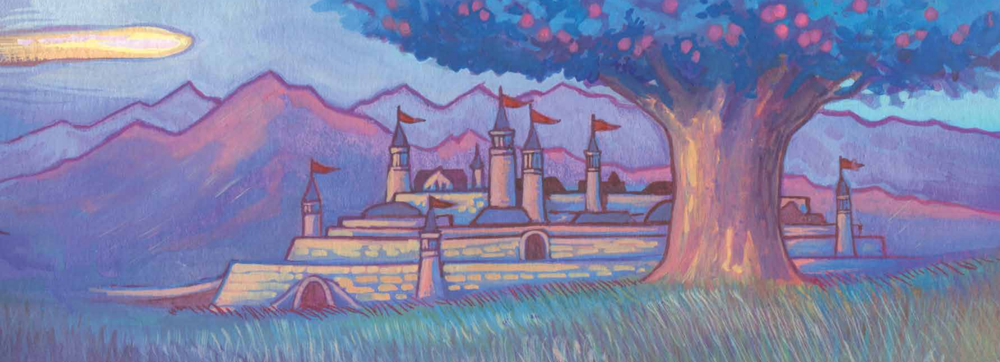

# Welcome to the TTRPG Hub!

## Navigation

- Dungeons and Dragons 🐉
    - [D&D Introduction](dnd/dnd-intro.md)
    - [House Rules](dnd/house-rules.md)
- FATE 🎲
    - [FATE Introduction](fate/fate-intro.md)
- Notes 📝
    - [Family Introduction](notes/family.md)
    - [Lacus Enodatio](notes/lellc.md)
    - [Sword Mountains](notes/sword-mountains.md)
    - [First Introduction](notes/first-intro.md)

## About

Welcome to my personal TTRPG reference site, dedicated to the wonderful world of tabletop role-playing games! Here you'll find a collection of resources, notes, and other information that I've gathered over the years. I hope you find it useful!

## Dungeons and Dragons 🐉

Explore the magical realm of Dungeons and Dragons, one of the most beloved and iconic TTRPGs ever created. Learn the basics with my [D&D Introduction](dnd/dnd-intro.md) and if you're playing in one of my games, check out the [House Rules and Expectations](dnd/house-rules.md).

## FATE 🎲

Delve into the narrative-driven world of FATE, where storytelling takes center stage. See the overview [FATE Introduction](fate/fate-intro.md) that compares and contrasts FATE with D&D. More to come!

## Notes 📝

Reference section for players past and present in my games.

*{ content on this site is a combination of efforts by the website author (BF) and AI generated content, hand-edited by the author (BF). It includes unmodified resources and links to resources not generated by the website author (BF). All content intended for personal use in games by the website author. See the content or source for licensing and rights information.}*
