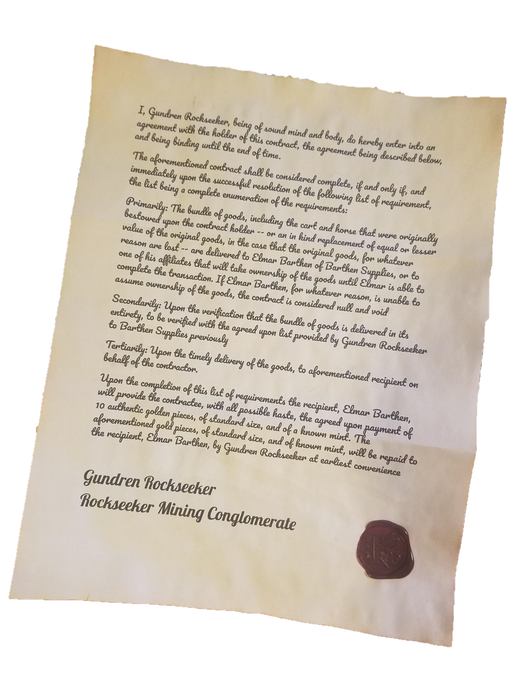
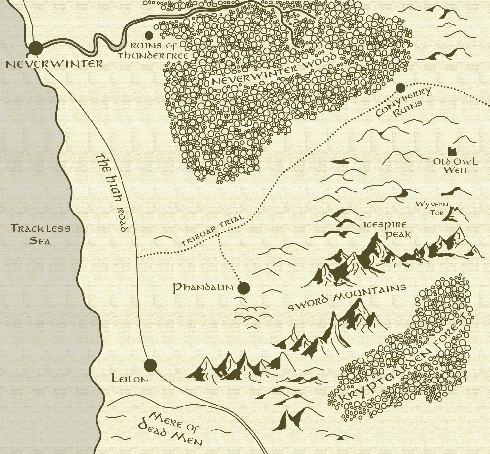
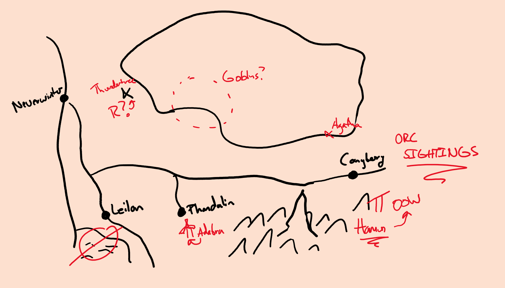
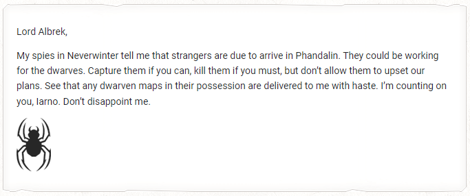

`Sister Garalee's Journal`

**2 Ches 1491**
Starting a fresh journal. There was a fair bit of commotion about the town today. The Rockseeker Brothers from Neverwinter appear to have discovered something in the mountains east of Phandalin. I fear what it could be. I will alert the other Harpers as soon as I can. They will want to keep whatever it is out of the hands of anyone that may throw off the tenuous balance of the coast. But for now, my focus remains on the offshoot of the Many Arrows tribe out east. There’s something off about these Redbrand fools, but it will have to wait as well.

**12 Ches 1491**
I received a missive from Hreth detailing my next mission. There’s a banshee residing near Conyberry to the east. She’s at least as old as the previous settlement Phandalin now stands on and likely knows more about the orc activity to the east. 
I hope Reidoth is doing well on his mission to the remains of Thundertree. I cannot imagine what could be of importance in that corrupted place. Nothing remains there but twisted plant life and those poor lost souls…

**17 Ches 1491**
I visited the banshee, Agatha, but she would not appear long for me. She told me she would only converse if I could settle an aspect of her past: retrieve a box from the Tower of Storms off the coast north of Leilon. She disappeared and offered no more details. It looks like I’m off to the coast!

**2 Tarsakh 1491**
I got it! It turns out the tower is owned by a mage. Before I reached it, in a cave along the path was another banshee. She was Agatha’s sister but shared no goodwill toward Agatha. I am not sure of the story there, but I am not here for stories. I barely managed to escape, but I did get the box from her lair by acting quickly and turning her away with the grace of Tymora. Luckily, banshees are tied to their haunting and cannot travel far from them so she gave little chase. 
The box itself is a strange one. It has four locks and came with four keys… I am not sure if I should try to open it before returning it to Agatha. I will sleep on it and decide in the morning.

